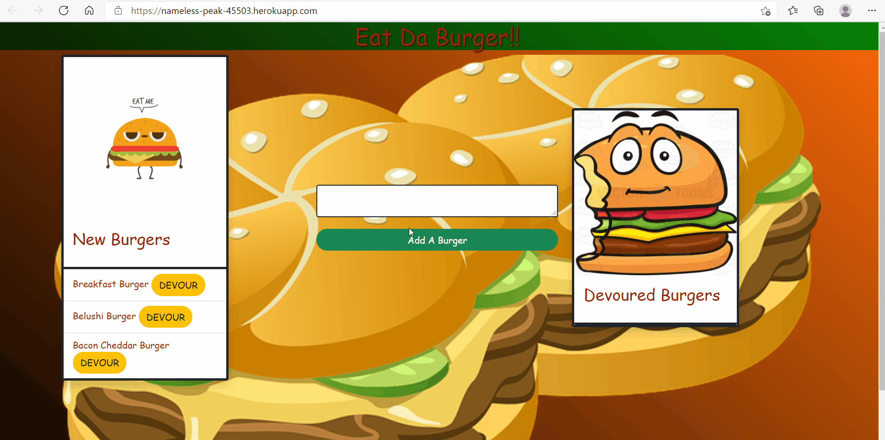

  # Eat Da Burger!
  ## Table of contents
  ---
  [Description](#description)

  [Installation](#installation)

  [Usage](#usage)

  [Tests](#tests)

  [Contributing](#contributing)

  [Questions](#questions)

  [Lisence](#lisence)

  ## Description
  This is a simple and fun application where the user can log types of burgers and keep track of whether the have beeneaten. It is a demonstration of a full-stack application using MySQL, Express, Handlebars, and the JAWSDB from Heroku.
  ## Installation
  
  Follow the link to the app  [HERE](https://nameless-peak-45503.herokuapp.com/).
  ## Usage
  
  None necessary

  
  ## Tests
  `There are no tests for this application.`
  ## Contributing
  Please note that this project is released with a Contributor Code of Conduct. By participating in this project you agree to abide by its terms.
  
  ## Questions
  [GitHub Repository](https://github.com/geoff7709/eat-da-burger)

  For further questions please feel free to email the developers:

  geoffzimmerman23@gmail.com
  ## Lisence
  Use of this software is regulated under the following lisence:

  [MIT](https://opensource.org/licenses/MIT)

  

